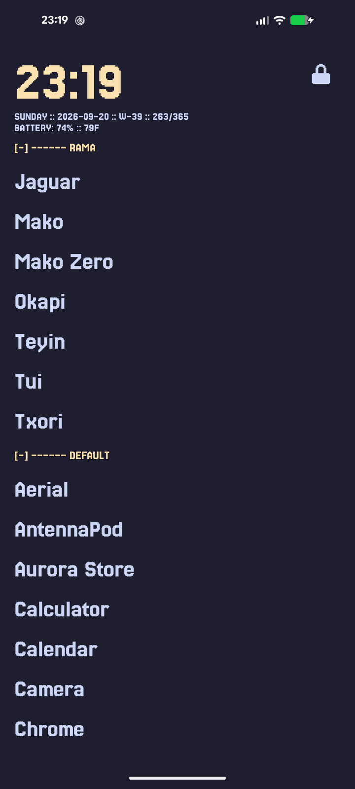
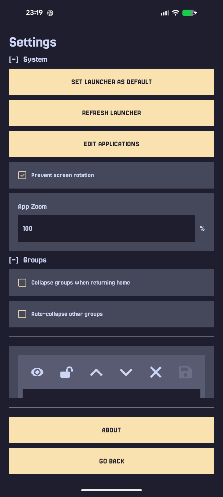
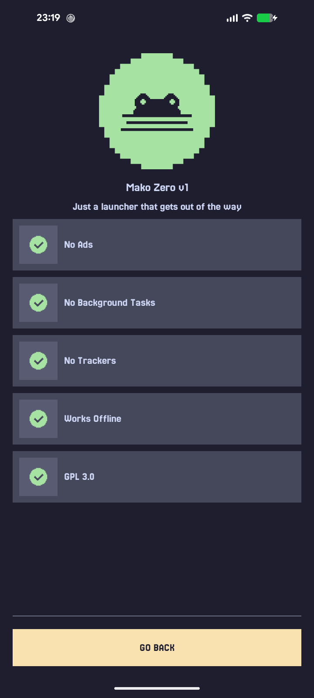

# Mako Zero

Just a launcher that gets out of the way.

Built entirely in **Java**, at just **145 KB**, and running fully **on-device**.

---

## Screenshots

| Home | Settings | About |
| - | - | - |
|  |  |  |

---

## Usage

- Long-press in an empty area of the **App List** to open **Settings**.
- Watch the **[Promo](https://youtu.be/u0R5YNajFHY)** for a quick
  overview.
- Join the **[Discord Community](https://discord.gg/zFFupY8PFE)** for support and updates.

---

## Installation

  
  &nbsp;
  

---

## Acknowledgements

Port of [Mako [Kotlin]](https://f-droid.org/en/packages/com.rama.mako/) Inspired by [YAML Launcher](https://f-droid.org/en/packages/eu.ottop.yamlauncher/) and [Pie Launcher](https://f-droid.org/en/packages/de.markusfisch.android.pielauncher/).
